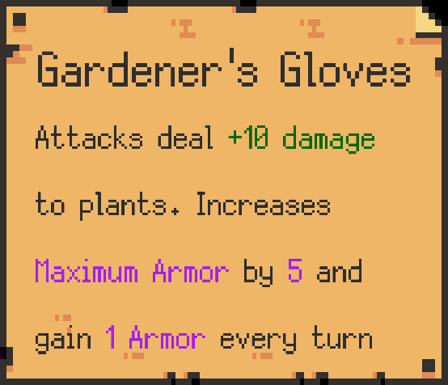
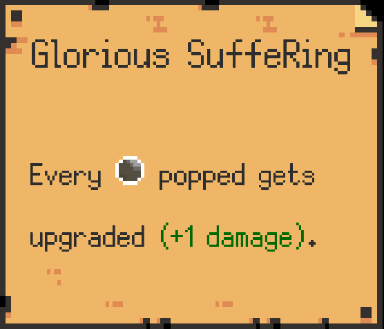
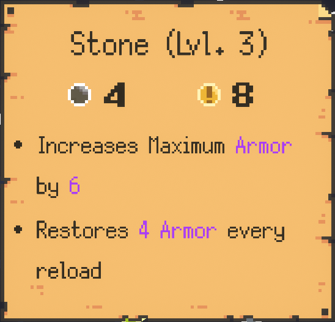
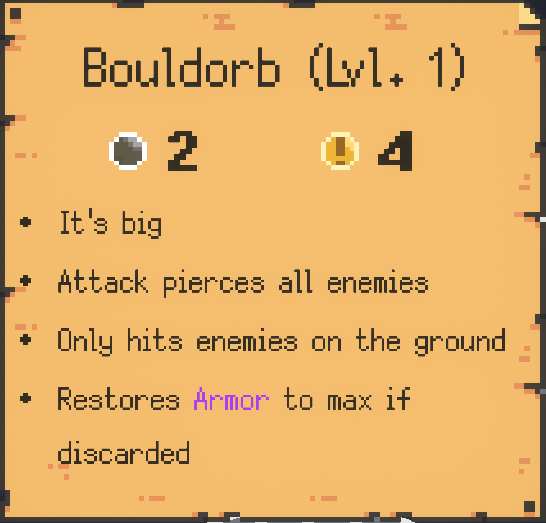
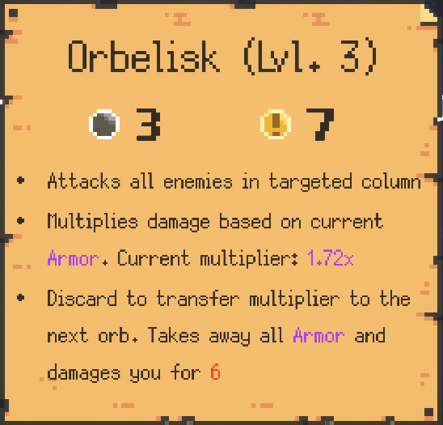

# Promethium
**This Mod does NOT work on the Demo. It is for the Early Access version of the Game**

The goal of the mod is to offer balance changes, new mechanics, and QoL features. It is currently in development, so please report any bugs found!

## Localization
Localization is being done at https://docs.google.com/spreadsheets/d/1r7o-GVIn6ljL4DvOIRY4eTTo1OhWjd-P2HyBS9UB0OI/edit#gid=0
If you want to help translate, feel free to!

## Installation
1. Download [Promethium](https://github.com/ruiner189/Promethium/releases)
2. Download [BepInEx_x64_5.x.x.x.zip](https://github.com/BepInEx/BepInEx/releases)
3. Go to your install directory for Peglin.
    * For Steam go to your Steam Library and right click Peglin > Manage > Browse Local Files
4. Unzip the BepInEx folder into your peglin directory
5. Launch Peglin. BepInEx will then create a plugins folder. Close Peglin after the game launches.
6. Put Promethium in your plugin folder (...\Peglin\Bepinex\plugins)

## Releases
| Peglin - Version| Mod Version | Link |
|----------|-------------|-----------------|
| v0.7.x | v1.0.6 | [Download](https://github.com/ruiner189/Promethium/releases/download/1.0.5/Promethium.dll) |
| v0.7.x | v1.0.5 | [Download](https://github.com/ruiner189/Promethium/releases/download/1.0.5/Promethium.dll) |
| v0.7.x | v1.0.4 | [Download](https://github.com/ruiner189/Promethium/releases/download/1.0.4/Promethium.dll) |
| v0.7.x | v1.0.3 | [Download](https://github.com/ruiner189/Promethium/releases/download/1.0.3/Promethium.dll) |
| v0.7.x | v1.0.2 | [Download](https://github.com/ruiner189/Promethium/releases/download/1.0.2/Promethium.dll) |
| v0.7.x | v1.0.1 | [Download](https://github.com/ruiner189/Promethium/releases/download/1.0.1/Promethium.dll) |
| v0.7.x | v1.0.0 | [Download](https://github.com/ruiner189/Promethium/releases/download/1.0.0/Promethium.dll) |

## Quality of Life Changes
* Game speeds up after 10 seconds of sending your orb out. It currently maxes out at 3x the gamespeed.
* You can now retarget after sending your orb out!
* You can turn off enemy turn on reload in the configs! Default is vanilla behavior.
* Confusion is removed while navigating

## New Mechanics
### Armor
Armor acts as a second resource for health. It is used up first, and has unique ways of replenishing it. The amount of armor you currently have is indicated by a status effect.
### Curse

Are you ready to test your pachinko skills? If you make it to the final boss, continuing the game will start a Cursed run. There are a total of 5 tiers. Can you make it to the end?
Each curse relic will make the enemies stronger in different ways. It'll also give the player a small buff so they might survive...

#### Starting a Curse Run
At the end of your current run (if you defeat the last boss), choose "Restart" to begin or increase your curse level. Each run will give you three choices of curse relics. The negative effect is the same, while you get to choose the benefit. Your relics from the previous run will be reduced according to your curse level. The higher the curse, the more relics you get to keep. However, you are only allowed to keep 4 orbs between runs.

## Relic Changes
### Gardener's Glove

----------

### Glorious SuffeRing

----------
### Weighted Chip
* Multipliers now cycles through 7 different layouts. Some layouts are rarer to get then others
   * 0.5x, 0.5x, 1x, 1x, 2x
   * 0.25x, 0.25x, 0.5x, 1.5x, 3x
   * 0.25x, 0.5x, 1x, 2x, 2x
   * 1x, 1x, 1x, 1x, 1x
   * 1.25x, 1.25x, 1x, 0.75x, 0.75x
   * 10x, 0x, 0x, 0x, 10x
   * 0x, 0x, 100x, 0x, 0x

## Orb Changes
### Stone

#### Normal Gameplay
Level 2
* Increases Maximum Armor by 3
* Replenishes Armor by 2 every reload

Level 3
* Increases Maximum Armor by 6
* Replenishes Armor by 4 every reload
#### Cruciball Lvl 3
Level 2
* Increases Maximum Armor by 2
* Replenishes Armor by 1 every reload

Level 3
* Increases Maximum Armor by 4
* Replenishes Armor by 2 every reload
----------
### Bouldorb

All Levels
* Replenishes Armor to maximum value if discarded
----------
### Orbelisk

Level 1
* Attack: 1 | Crit: 3
* Multiplies damage based on current armor (0.08 * currentArmor)
* On discard transfers multiplier to next orb. Removes all armor and damages player on the amount of armor

Level 2
* Attack: 2 | Crit: 5
* Multiplies damage based on current armor (0.10 * currentArmor)
* On discard transfers multiplier to next orb. Removes all armor and damages player on the amount of armor

Level 3
* Attack: 3 | Crit: 7
* Multiplies damage based on current armor (0.12 * currentArmor)
* On discard transfers multiplier to next orb. Removes all armor and damages player on the amount of armor
